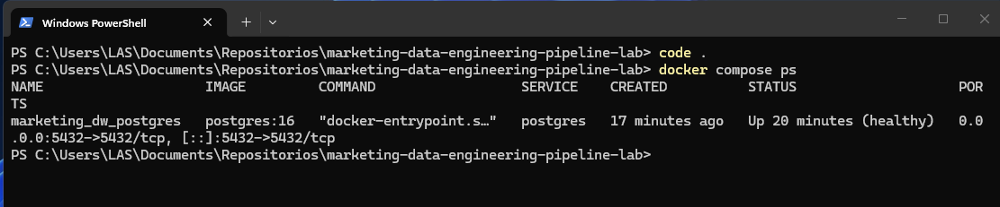
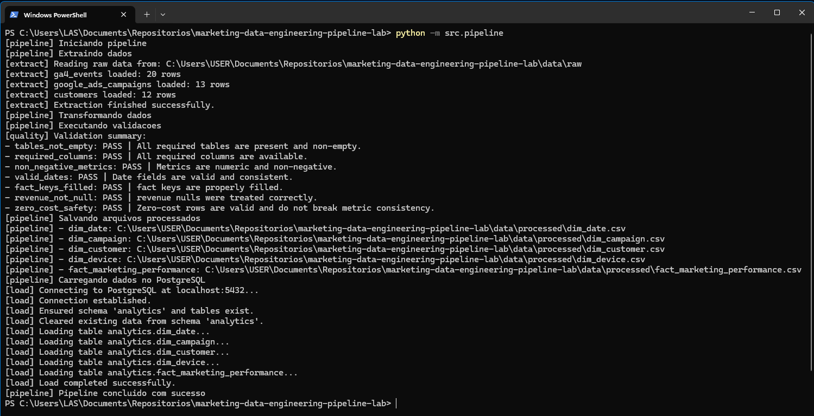
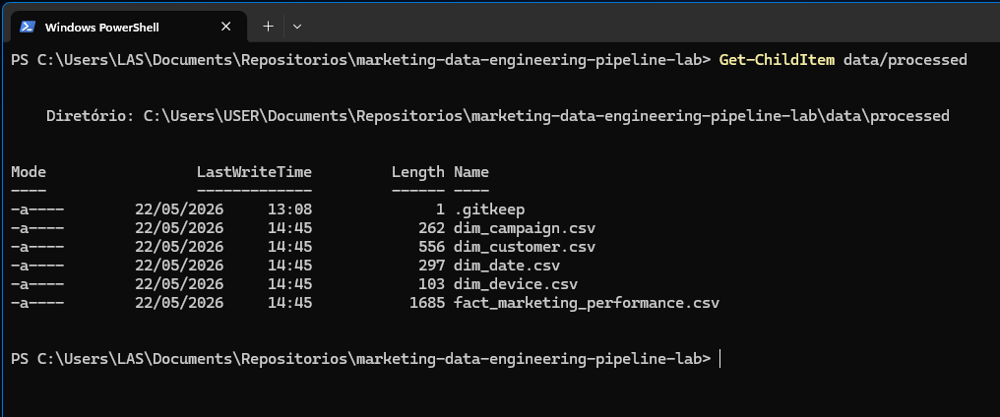
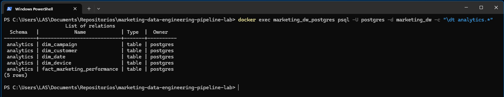
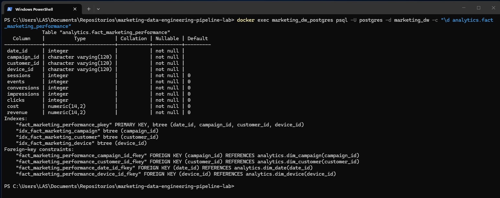
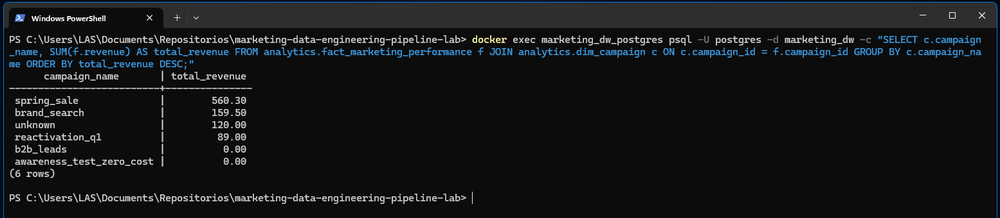
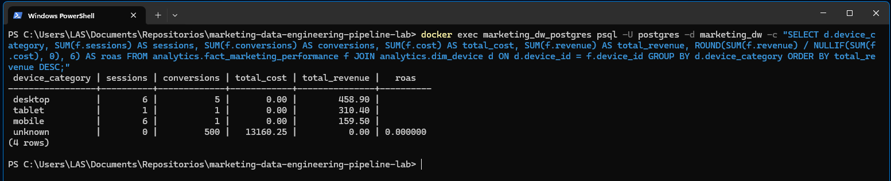
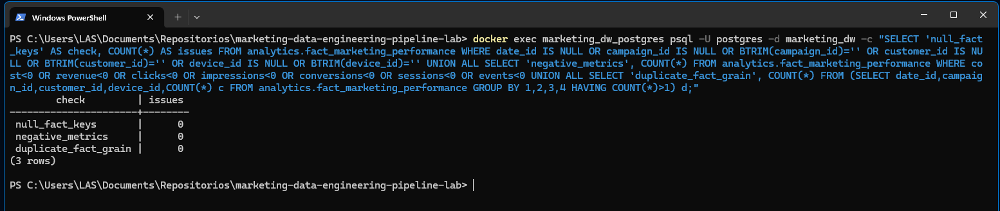
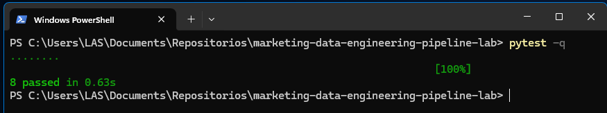
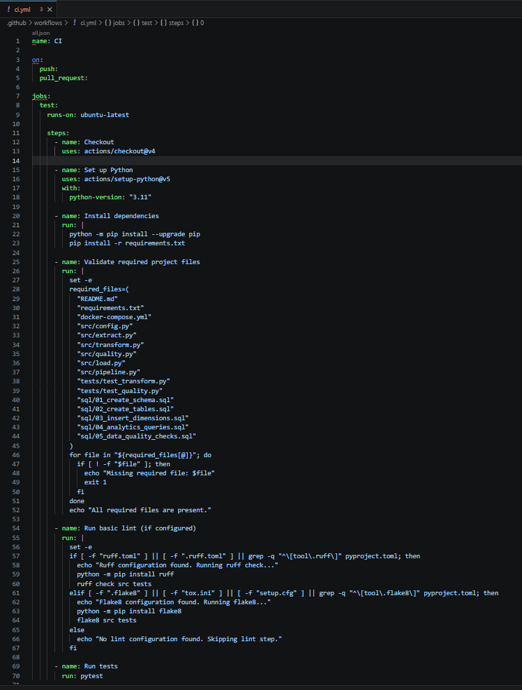

# Marketing Data Engineering Pipeline Lab

[](https://www.python.org/)
[](https://www.postgresql.org/)
[](https://www.docker.com/)
[](https://github.com/features/actions)
[](./LICENSE)

Projeto de portfólio com foco em demonstrar, de forma prática e objetiva, competências de Engenharia de Dados aplicadas a um cenário de marketing digital com dados sintéticos.

<a id="sumario"></a>
## 📚 Sumário

- [Objetivo do Projeto](#objetivo-do-projeto)
- [Problema de Negócio Simulado](#problema-de-negócio-simulado)
- [Arquitetura da Solução](#arquitetura-da-solução)
- [Tecnologias Utilizadas](#tecnologias-utilizadas)
- [Competências Demonstradas Neste Projeto](#competências-demonstradas-neste-projeto)
- [Estrutura do Projeto](#estrutura-do-projeto)
- [Como Executar Localmente](#como-executar-localmente)
- [Como Rodar com Docker](#como-rodar-com-docker)
- [Como Executar o Pipeline](#como-executar-o-pipeline)
- [Comandos Makefile](#comandos-makefile)
- [Como Rodar Testes](#como-rodar-testes)
- [Integração Contínua com GitHub Actions](#integração-contínua-com-github-actions)
- [Modelo de Dados](#modelo-de-dados)
- [Consultas Analíticas Disponíveis](#consultas-analíticas-disponíveis)
- [Por que este projeto é relevante para Engenharia de Dados?](#por-que-este-projeto-é-relevante-para-engenharia-de-dados)
- [Como este projeto se conecta a cenários reais de negócio?](#como-este-projeto-se-conecta-a-cenários-reais-de-negócio)
- [Evoluções futuras](#evoluções-futuras)
- [Extensão opcional para GCP e BigQuery](#extensão-opcional-para-gcp-e-bigquery)
- [Prints e Evidências de Execução](#prints-e-evidências-de-execução)
- [Autor](#autor)

## Objetivo do Projeto

[Voltar ao Sumário](#sumario)

Construir um pipeline de dados de marketing digital ponta a ponta para demonstrar habilidades de:

- ingestão e transformação de dados com Python;
- validação de qualidade de dados;
- modelagem dimensional;
- carga em PostgreSQL;
- versionamento, testes e CI.

## Problema de Negócio Simulado

[Voltar ao Sumário](#sumario)

Um time de Marketing Performance precisa consolidar dados de múltiplas fontes para responder perguntas como:

- quais campanhas geram mais receita;
- qual custo está associado à aquisição;
- como evoluem conversões e eficiência por canal ao longo do tempo;
- quais inconsistências de dados podem distorcer decisões.

O projeto resolve esse problema com um pipeline reproduzível, transparente e orientado a análise.

## Arquitetura da Solução

[Voltar ao Sumário](#sumario)

### Diagrama textual da arquitetura

[Voltar ao Sumário](#sumario)

```text
Fontes simuladas
GA4 Events | Google Ads | Customers
        ↓
Camada Raw - CSV
        ↓
Pipeline Python - Extract, Transform, Quality, Load
        ↓
Camada Processed
        ↓
PostgreSQL Analytics Schema
        ↓
Consultas SQL, métricas e análises de performance
```

### Fluxo operacional

[Voltar ao Sumário](#sumario)

1. `extract`: lê os arquivos em `data/raw`.
2. `transform`: padroniza e cria `dim_date`, `dim_campaign`, `dim_customer`, `dim_device` e `fact_marketing_performance`.
3. `quality`: valida integridade, nulos, métricas negativas e consistência de datas.
4. `save`: persiste dados transformados em `data/processed`.
5. `load`: cria schema `analytics` e carrega tabelas no PostgreSQL.

## Tecnologias Utilizadas

[Voltar ao Sumário](#sumario)

| Tecnologia | Papel no projeto | Nível de uso |
|---|---|---|
| Python 3.11+ | Orquestração, transformação e validações | Principal |
| Pandas | Manipulação tabular e agregações | Principal |
| PostgreSQL 16 | Camada analítica relacional (`analytics`) | Principal |
| SQLAlchemy + Psycopg | Conexão e carga para PostgreSQL | Suporte crítico |
| Docker Compose | Ambiente local reproduzível | Infra local |
| SQL | DDL, consultas analíticas e checks de qualidade | Principal |
| Pytest | Testes automatizados | Qualidade |
| GitHub Actions | Integração contínua | Engenharia de software |

## Competências Demonstradas Neste Projeto

[Voltar ao Sumário](#sumario)

| Competência | Evidência prática no repositório |
|---|---|
| Python para Engenharia de Dados | `src/extract.py`, `src/transform.py`, `src/pipeline.py` |
| SQL aplicado a análise e validação | `sql/04_analytics_queries.sql`, `sql/05_data_quality_checks.sql` |
| ETL/ELT | Fluxo extract → transform → quality → load |
| PostgreSQL | Carga no schema `analytics` via `src/load.py` |
| Docker | Ambiente local com `docker-compose.yml` |
| Modelagem dimensional | Tabelas `dim_*` e `fact_marketing_performance` |
| Data Warehouse | Estrutura analítica orientada a métricas |
| Qualidade de dados | `src/quality.py` + testes |
| Documentação técnica | `README.md` + pasta `docs/` |
| GitHub Actions | Workflow em `.github/workflows/ci.yml` |
| Boas práticas de versionamento | Estrutura modular, testes e CI |

## Estrutura do Projeto

[Voltar ao Sumário](#sumario)

```text
marketing-data-engineering-pipeline-lab/
├── .env.example
├── .gitignore
├── .github/workflows/ci.yml
├── README.md
├── LICENSE
├── AGENTS.md
├── docker-compose.yml
├── pyproject.toml
├── requirements.txt
├── Makefile
├── data/
│   ├── raw/
│   ├── processed/
│   └── samples/
├── docs/
│   ├── architecture.md
│   ├── data_model.md
│   ├── gcp_bigquery_extension.md
│   ├── troubleshooting.md
│   └── screenshots/
│       ├── 01_setup/
│       ├── 02_pipeline/
│       ├── 03_database/
│       ├── 04_queries/
│       └── 05_tests_ci/
├── sql/
│   ├── 01_create_schema.sql
│   ├── 02_create_tables.sql
│   ├── 03_insert_dimensions.sql
│   ├── 04_analytics_queries.sql
│   └── 05_data_quality_checks.sql
├── src/
│   ├── config.py
│   ├── extract.py
│   ├── transform.py
│   ├── quality.py
│   ├── load.py
│   └── pipeline.py
└── tests/
    ├── test_transform.py
    └── test_quality.py
```

## Como Executar Localmente

[Voltar ao Sumário](#sumario)

1. Clonar o repositório:

```bash
git clone https://github.com/brodyandre/marketing-data-engineering-pipeline-lab.git
cd marketing-data-engineering-pipeline-lab
```

2. Criar ambiente virtual e instalar dependências:

```bash
python -m venv .venv
source .venv/bin/activate
# Windows PowerShell:
# .\.venv\Scripts\Activate.ps1
pip install -r requirements.txt
```

3. Configurar variáveis:

```bash
cp .env.example .env
# Windows PowerShell:
# Copy-Item .env.example .env
```

## Como Rodar com Docker

[Voltar ao Sumário](#sumario)

Subir PostgreSQL local:

```bash
docker compose up -d
```

Subir pgAdmin (opcional):

```bash
docker compose --profile tools up -d
```

Acesso ao pgAdmin:

- URL: `http://localhost:8080`
- E-mail: `admin@admin.com`
- Senha: `admin`

Parâmetros para conexão no pgAdmin:

- Host: `postgres`
- Port: `5432`
- Database: `marketing_dw`
- Username: `postgres`
- Password: `postgres`

Parar ambiente:

```bash
docker compose down
```

Se você alterou credenciais e houver conflito de autenticação, recrie o volume:

```bash
docker compose down -v
docker compose up -d
```

## Como Executar o Pipeline

[Voltar ao Sumário](#sumario)

Execução completa:

```bash
python -m src.pipeline
```

Execução por etapa:

```bash
python -m src.extract
python -m src.transform
python -m src.quality
python -m src.load
```

## Comandos Makefile

[Voltar ao Sumário](#sumario)

```bash
make install
make up
make quality
make pipeline
make test
make clean
make down
```

- `make install`: instala dependências.
- `make up`: sobe docker compose.
- `make down`: derruba docker compose.
- `make pipeline`: executa `python -m src.pipeline`.
- `make test`: executa testes com `pytest`.
- `make clean`: remove caches e temporários.
- `make quality`: executa validações de qualidade.

## Como Rodar Testes

[Voltar ao Sumário](#sumario)

```bash
pytest
```

## Integração Contínua com GitHub Actions

[Voltar ao Sumário](#sumario)

Workflow em [`.github/workflows/ci.yml`](./.github/workflows/ci.yml), executado em:

- `push`
- `pull_request`

Etapas da CI:

1. setup do Python 3.11;
2. instalação de dependências;
3. lint básico (se configurado);
4. validação de arquivos principais;
5. execução de testes com `pytest`.

## Modelo de Dados

[Voltar ao Sumário](#sumario)

Modelo dimensional em schema `analytics`:

- `dim_date`: dimensão temporal.
- `dim_campaign`: dimensão de campanhas e aquisição.
- `dim_customer`: dimensão de segmentação de cliente.
- `dim_device`: dimensão de dispositivo (`desktop`, `mobile`, `tablet`, `unknown`).
- `fact_marketing_performance`: fato no grão `date_id + campaign_id + customer_id + device_id`.

Métricas centrais:

- `sessions`, `events`, `conversions`
- `impressions`, `clicks`
- `cost`, `revenue`

Detalhamento: [`docs/data_model.md`](./docs/data_model.md)

## Consultas Analíticas Disponíveis

[Voltar ao Sumário](#sumario)

Arquivo: [`sql/04_analytics_queries.sql`](./sql/04_analytics_queries.sql)

Exemplos:

- receita e custo por campanha;
- CTR, CPC, taxa de conversão e ROAS;
- receita por origem;
- ranking de campanhas.

Validações SQL: [`sql/05_data_quality_checks.sql`](./sql/05_data_quality_checks.sql)

## Por que este projeto é relevante para Engenharia de Dados?

[Voltar ao Sumário](#sumario)

Porque demonstra o ciclo técnico completo esperado em times de dados:

- ingestão e normalização de múltiplas fontes;
- modelagem para analytics;
- qualidade de dados tratada como etapa obrigatória;
- carga em banco relacional;
- automação de testes e CI.

Em contexto de recrutamento, evidencia domínio de fundamentos com foco em execução prática.

## Como este projeto se conecta a cenários reais de negócio?

[Voltar ao Sumário](#sumario)

Mesmo com dados sintéticos, o desenho reproduz desafios reais:

- consolidação de dados de marketing com granularidades diferentes;
- criação de camada confiável para decisões de investimento;
- monitoramento de métricas críticas de aquisição e conversão;
- rastreabilidade e governança mínima para evolução em escala.

Esse padrão é aplicável a e-commerce, SaaS, educação, fintech e operações B2B.

## Evoluções futuras

[Voltar ao Sumário](#sumario)

1. Orquestração com Airflow.
2. Camada de transformação com dbt.
3. Testes de integração com PostgreSQL na CI.
4. Publicação de dashboard em Metabase/Superset.
5. Migração para arquitetura cloud (GCP + BigQuery).

## Extensão opcional para GCP e BigQuery

[Voltar ao Sumário](#sumario)

Há uma proposta de evolução da arquitetura para Google Cloud Platform, mantendo o foco didático e sem qualquer credencial real neste repositório.

Documentação: [`docs/gcp_bigquery_extension.md`](./docs/gcp_bigquery_extension.md)

## Prints e Evidências de Execução

[Voltar ao Sumário](#sumario)

### 1) Docker Compose com PostgreSQL saudável

[Voltar ao Sumário](#sumario)
Pasta: `docs/screenshots/01_setup`
Nome do arquivo: `01_docker_compose_ps_healthy.png`


### 2) Execução completa do pipeline

[Voltar ao Sumário](#sumario)
Pasta: `docs/screenshots/02_pipeline`
Nome do arquivo: `02_pipeline_run_success.png`


### 3) Artefatos processados gerados

[Voltar ao Sumário](#sumario)
Pasta: `docs/screenshots/02_pipeline`
Nome do arquivo: `03_processed_files_generated.png`


### 4) Tabelas do schema analytics no PostgreSQL

[Voltar ao Sumário](#sumario)
Pasta: `docs/screenshots/03_database`
Nome do arquivo: `04_postgres_analytics_tables.png`


### 5) Estrutura da fato com PK/FKs

[Voltar ao Sumário](#sumario)
Pasta: `docs/screenshots/03_database`
Nome do arquivo: `05_fact_table_constraints.png`


### 6) Query de negócio: receita por campanha

[Voltar ao Sumário](#sumario)
Pasta: `docs/screenshots/04_queries`
Nome do arquivo: `06_query_revenue_by_campaign.png`


### 7) Query de negócio: performance por dispositivo

[Voltar ao Sumário](#sumario)
Pasta: `docs/screenshots/04_queries`
Nome do arquivo: `07_query_device_performance.png`


### 8) Data quality checks em SQL

[Voltar ao Sumário](#sumario)
Pasta: `docs/screenshots/04_queries`
Nome do arquivo: `08_data_quality_sql_checks.png`


### 9) Testes automatizados com pytest

[Voltar ao Sumário](#sumario)
Pasta: `docs/screenshots/05_tests_ci`
Nome do arquivo: `09_pytest_passed.png`


### 10) Pipeline de CI no GitHub Actions

[Voltar ao Sumário](#sumario)

#### Print do fluxo de execução do pipeline de dados.

Pasta: `docs/screenshots/05_tests_ci`
Nome do arquivo: `10_github_actions_ci_workflow.png`


## Autor

[Voltar ao Sumário](#sumario)

**Luiz André de Souza**

- GitHub: https://github.com/brodyandre
- LinkedIn: www.linkedin.com/in/luiz-andre-souza-data-engineer
